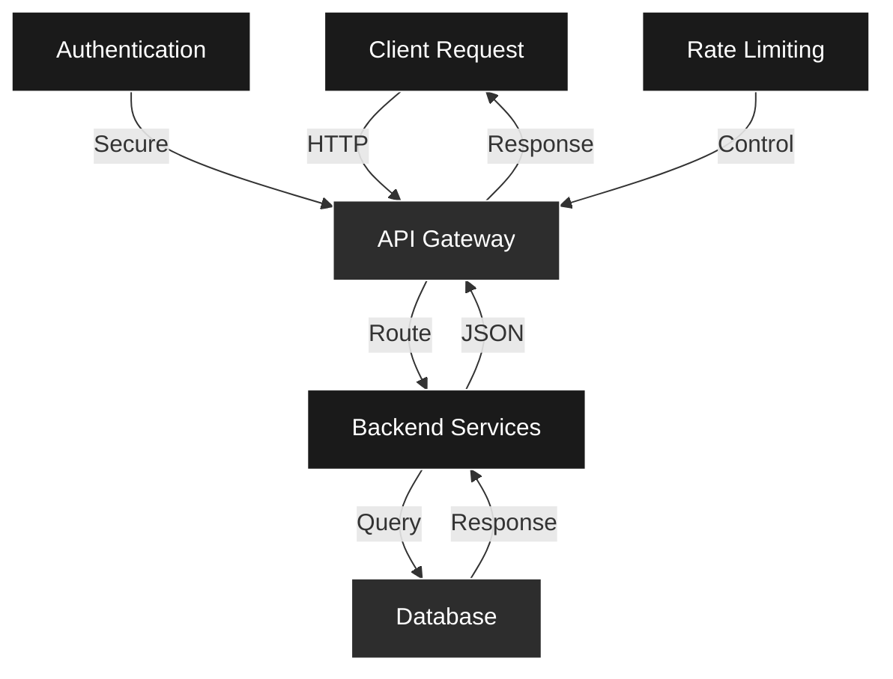

<div align="center">

```ascii
╔══════════════════════════════════════════════════════════════════╗
║                                                                  ║
║   ███╗   ██╗ █████╗ ██╗   ██╗██╗   ██╗     ██████╗ ██╗██████╗  ║
║   ████╗  ██║██╔══██╗██║   ██║╚██╗ ██╔╝    ██╔════╝ ██║██╔══██╗ ║
║   ██╔██╗ ██║███████║██║   ██║ ╚████╔╝     ██║  ███╗██║██████╔╝ ║
║   ██║╚██╗██║██╔══██║╚██╗ ██╔╝  ╚██╔╝      ██║   ██║██║██╔══██╗ ║
║   ██║ ╚████║██║  ██║ ╚████╔╝    ██║       ╚██████╔╝██║██████╔╝ ║
║   ╚═╝  ╚═══╝╚═╝  ╚═╝  ╚═══╝     ╚═╝        ╚═════╝ ╚═╝╚═════╝  ║
║                                                                  ║
║              Backend Developer • API Specialist                 ║
║                                                                  ║
╚══════════════════════════════════════════════════════════════════╝
```

<div align="center">
  
</div>

[](https://instagram.com/navygibran) [](https://linkedin.com/in/navy-gibran-29950528a) [](mailto:navygibran16@gmail.com)

</div>

---

## About Me

```go
package main

type Developer struct {
    Name        string
    Role        string
    Skills      []string
    Focus       string
}

func NewDeveloper() *Developer {
    return &Developer{
        Name:    "Navy Gibran",
        Role:    "Backend Developer & API Specialist",
        Skills:  []string{"Go", "PHP", "TypeScript", "PostgreSQL"},
        Focus:   "Building scalable backend systems and robust APIs",
    }
}
```

---

## Tech Stack

<div align="center">

### Languages


### Frameworks & Libraries


### Databases


### Tools & Platforms


</div>

---

## Coding Activity

<div align="center">

[](https://wakatime.com/@3fd3cf75-1b26-4ae1-a40b-2e88fcf58d46)

 

</div>

---

## GitHub Statistics

<div align="center">


</div>

---

## Achievements

<div align="center">


</div>

---

## Current Focus

```typescript
interface DeveloperFocus {
  current_work: string;
  learning: string[];
  interests: string;
  contributions: number;
}

const myFocus: DeveloperFocus = {
  current_work: "Building scalable backend systems",
  learning: [
    "Advanced Go patterns",
    "Cloud architecture",
    "Microservices design"
  ],
  interests: "Open source collaboration and system optimization",
  contributions: 1000
};
```

---

## System Architecture



---

## Contribution Graph

<picture>
  <source media="(prefers-color-scheme: dark)" srcset="https://raw.githubusercontent.com/nepskuy/nepskuy/output/pacman-contribution-graph-dark.svg">
  <source media="(prefers-color-scheme: light)" srcset="https://raw.githubusercontent.com/nepskuy/nepskuy/output/pacman-contribution-graph.svg">
  
</picture>

---

## Development Philosophy

<div align="center">

```
╔═══════════════════════════════════════════════════════════╗
║                                                           ║
║  • Write clean, maintainable code                        ║
║  • Test thoroughly before deployment                     ║
║  • Document for future developers                        ║
║  • Optimize for performance and scalability              ║
║  • Embrace continuous learning                           ║
║                                                           ║
╚═══════════════════════════════════════════════════════════╝
```

</div>

---

<div align="center">

### Connect With Me

[](https://visitcount.itsvg.in)

---

*"First, solve the problem. Then, write the code."* – John Johnson

---

Built with passion by [nepskuy](https://github.com/nepskuy)

</div>