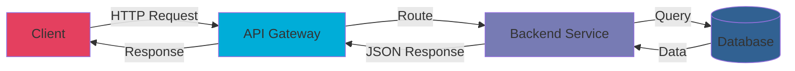

<div align="center">

# 🚀 Navy Gibran | Backend Engineer

```ascii
███╗   ██╗ █████╗ ██╗   ██╗██╗   ██╗
████╗  ██║██╔══██╗██║   ██║╚██╗ ██╔╝
██╔██╗ ██║███████║██║   ██║ ╚████╔╝ 
██║╚██╗██║██╔══██║╚██╗ ██╔╝  ╚██╔╝  
██║ ╚████║██║  ██║ ╚████╔╝    ██║   
╚═╝  ╚═══╝╚═╝  ╚═╝  ╚═══╝     ╚═╝   
```

### 💬 *"Building robust APIs, one endpoint at a time"*

[](https://instagram.com/navygibran) [](https://linkedin.com/in/navy-gibran-29950528a) [](mailto:navygibran16@gmail.com)

</div>

---

## 📡 API Endpoint Documentation

```json
{
  "status": 200,
  "message": "Developer Profile Loaded Successfully",
  "data": {
    "name": "Navy Gibran",
    "role": "Backend Engineer",
    "specialization": ["RESTful APIs", "Database Design", "System Architecture"],
    "currently_working_on": "Building scalable backend systems",
    "learning": "Advanced Go patterns & Cloud Architecture",
    "open_to": "Collaboration on interesting projects"
  }
}
```

---

## 🛠️ Tech Stack

### **Backend & Languages**


### **Frontend & Frameworks**


### **Databases**


### **Tools & Platforms**


---

## ⏱️ Weekly Development Breakdown

<!--START_SECTION:waka-->
[](https://wakatime.com/@3fd3cf75-1b26-4ae1-a40b-2e88fcf58d46)

 

<!--END_SECTION:waka-->

---

## 📊 GitHub Analytics

<div align="center">


</div>

---

## 🏆 GitHub Achievements

<div align="center">


</div>

---

## 🔥 Top Contributed Repositories

<div align="center">


</div>

---

## 🎯 API Request Flow



---

## 📈 Contribution Activity

<picture>
  <source media="(prefers-color-scheme: dark)" srcset="https://raw.githubusercontent.com/nepskuy/nepskuy/output/pacman-contribution-graph-dark.svg">
  <source media="(prefers-color-scheme: light)" srcset="https://raw.githubusercontent.com/nepskuy/nepskuy/output/pacman-contribution-graph.svg">
  
</picture>

---

## 💡 Quick API Facts

```typescript
interface DeveloperStats {
  totalCommits: number;
  linesOfCode: number;
  coffeeConsumed: number;
  bugsSquashed: number;
}

const navyStats: DeveloperStats = {
  totalCommits: 1000+,
  linesOfCode: 50000+,
  coffeeConsumed: Infinity,
  bugsSquashed: 9999
};
```

---

<div align="center">

### 📫 Let's Connect & Build Something Amazing!

[](https://visitcount.itsvg.in)

*"Code is like humor. When you have to explain it, it's bad."* – Cory House

---

⭐️ From [nepskuy](https://github.com/nepskuy) with 💙

</div>