<div align="center">

```ascii
╔══════════════════════════════════════════════════════════════════╗
║                                                                  ║
║   ███╗   ██╗ █████╗ ██╗   ██╗██╗   ██╗     ██████╗ ██╗██████╗  ║
║   ████╗  ██║██╔══██╗██║   ██║╚██╗ ██╔╝    ██╔════╝ ██║██╔══██╗ ║
║   ██╔██╗ ██║███████║██║   ██║ ╚████╔╝     ██║  ███╗██║██████╔╝ ║
║   ██║╚██╗██║██╔══██║╚██╗ ██╔╝  ╚██╔╝      ██║   ██║██║██╔══██╗ ║
║   ██║ ╚████║██║  ██║ ╚████╔╝    ██║       ╚██████╔╝██║██████╔╝ ║
║   ╚═╝  ╚═══╝╚═╝  ╚═╝  ╚═══╝     ╚═╝        ╚═════╝ ╚═╝╚═════╝  ║
║                                                                  ║
║              ⚔️  CODE KNIGHT • API ARCHITECT ⚔️                 ║
║                                                                  ║
╚══════════════════════════════════════════════════════════════════╝
```

<div align="center">
  
</div>

[](https://instagram.com/navygibran) [](https://linkedin.com/in/navy-gibran-29950528a) [](mailto:navygibran16@gmail.com)

</div>

---

## ⚔️ THE KNIGHT'S OATH

```go
package main

type CodeKnight struct {
    Name        string
    Title       string
    Weapon      []string
    Mission     string
    Honor       int
}

func NewKnight() *CodeKnight {
    return &CodeKnight{
        Name:    "Navy Gibran",
        Title:   "Guardian of the Backend Realm",
        Weapon:  []string{"Go", "PHP", "TypeScript", "PostgreSQL"},
        Mission: "To build unbreakable APIs and defend system integrity",
        Honor:   9999,
    }
}

// The Knight's Creed
func (k *CodeKnight) Fight() string {
    return "I shall write clean code, crush bugs mercilessly, " +
           "and protect data with my life. No endpoint shall fall " +
           "on my watch. No query shall remain unoptimized."
}
```

---

## 🗡️ ARSENAL & BATTLE GEAR

<div align="center">

### ⚔️ Primary Weapons


### 🛡️ Shields & Defense


### 🏰 Fortress & Strongholds


### ⚙️ Knight's Tools


</div>

---

## 🏹 TRAINING GROUNDS

<div align="center">

[](https://wakatime.com/@3fd3cf75-1b26-4ae1-a40b-2e88fcf58d46)

 

</div>

---

## 🏆 BATTLE STATISTICS

<div align="center">


</div>

---

## 🎖️ MEDALS OF HONOR

<div align="center">


</div>

---

## 🗺️ CONQUEST MAP

```typescript
interface KnightQuest {
  current_mission: string;
  learning: string[];
  seeking: string;
  conquests: number;
}

const myJourney: KnightQuest = {
  current_mission: "Building fortress-grade backend systems",
  learning: [
    "Advanced Go battle tactics",
    "Cloud realm architecture",
    "Microservices warfare strategies"
  ],
  seeking: "Fellow knights for epic collaborations",
  conquests: 1000 // commits and counting
};

// The Path of the Code Knight
async function conquerChallenges(): Promise<void> {
  while (true) {
    await writeCleanCode();
    await slayBugs();
    await optimizeQueries();
    await deployToProduction();
    
    console.log("Another victory for the realm! ⚔️");
  }
}
```

---

## 🛡️ API BATTLEGROUND ARCHITECTURE

```mermaid
graph TB
    A[⚔️ Knight Request] -->|HTTP POST| B[🏰 API Gateway Fortress]
    B -->|Route to Squadron| C[🗡️ Backend Warriors]
    C -->|Strategic Query| D[📚 Data Vault]
    D -->|Intelligence Report| C
    C -->|JSON Shield| B
    B -->|Victory Response| A
    
    E[🛡️ Auth Guard] -->|Protect| B
    F[⚙️ Rate Limiter] -->|Control| B
    
    style A fill:#1a1a1a,stroke:#fff,color:#fff
    style B fill:#2d2d2d,stroke:#fff,color:#fff
    style C fill:#1a1a1a,stroke:#fff,color:#fff
    style D fill:#2d2d2d,stroke:#fff,color:#fff
    style E fill:#1a1a1a,stroke:#fff,color:#fff
    style F fill:#1a1a1a,stroke:#fff,color:#fff
```



---

## ⚔️ LEGENDARY CONQUESTS

<div align="center">


</div>

---

## 🗡️ THE KNIGHT'S CODE

```php
<?php

class CodeKnight {
    private const PRINCIPLES = [
        'HONOR' => 'Write code that others will praise',
        'COURAGE' => 'Face bugs without fear',
        'DISCIPLINE' => 'Test before you deploy',
        'LOYALTY' => 'Never abandon your codebase',
        'WISDOM' => 'Document for those who follow',
    ];
    
    public function defendTheRealm(): void 
    {
        // A knight's duty is never done
        foreach (self::PRINCIPLES as $virtue => $oath) {
            $this->uphold($virtue, $oath);
        }
        
        echo "For the glory of clean code! ⚔️\n";
    }
}

// In service of the digital realm
$knight = new CodeKnight();
$knight->defendTheRealm();
```

---

## 📜 BATTLE CHRONICLE

<picture>
  <source media="(prefers-color-scheme: dark)" srcset="https://raw.githubusercontent.com/nepskuy/nepskuy/output/pacman-contribution-graph-dark.svg">
  <source media="(prefers-color-scheme: light)" srcset="https://raw.githubusercontent.com/nepskuy/nepskuy/output/pacman-contribution-graph.svg">
  
</picture>

---

## 🎯 KNIGHT'S CREED

<div align="center">

```
╔═══════════════════════════════════════════════════════════╗
║                                                           ║
║  "In the realm of code, I am the guardian.               ║
║   In the battle of bugs, I am the warrior.               ║
║   In the forge of innovation, I am the smith.            ║
║   My APIs shall stand eternal,                           ║
║   My databases shall remain unbreached,                  ║
║   My code shall be my legacy."                           ║
║                                                           ║
║                    - Navy Gibran, Code Knight            ║
║                                                           ║
╚═══════════════════════════════════════════════════════════╝
```

</div>

---

<div align="center">

### ⚔️ JOIN THE FELLOWSHIP

[](https://visitcount.itsvg.in)

```ascii
    ⚔️
   /|||\ 
  / ||| \
 |  |||  |
 |  |||  |
    |||
    |||
   /   \
  /     \
```

**Forged in Code • Tempered by Bugs • Sharpened by Experience**

---

*"First, solve the problem. Then, write the code."* – John Johnson

---

⚔️ From the forge of [nepskuy](https://github.com/nepskuy)

</div>